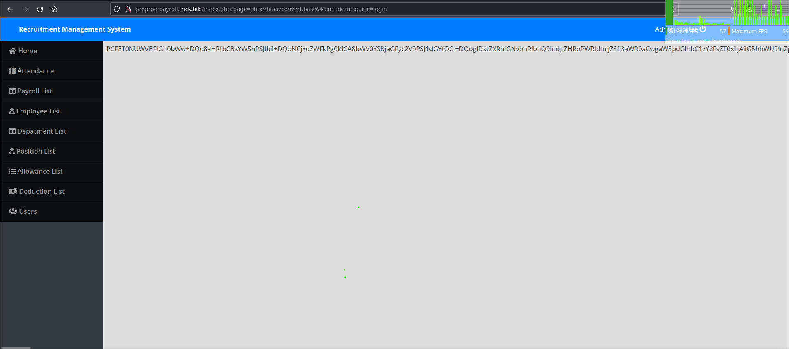
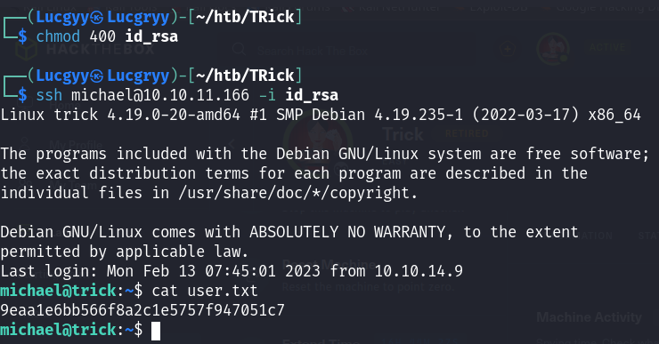

<div align='center'>

# **HTB Trick Write Up**

</div>

## **Nmap**

```zsh
sudo nmap -sC -sV -oA nmap/Trick 10.10.11.166
```

```
Nmap scan report for 10.10.11.166
Host is up (0.38s latency).
Not shown: 996 closed tcp ports (reset)
PORT   STATE SERVICE VERSION
22/tcp open  ssh     OpenSSH 7.9p1 Debian 10+deb10u2 (protocol 2.0)
| ssh-hostkey: 
|   2048 61ff293b36bd9dacfbde1f56884cae2d (RSA)
|   256 9ecdf2406196ea21a6ce2602af759a78 (ECDSA)
|_  256 7293f91158de34ad12b54b4a7364b970 (ED25519)
25/tcp open  smtp    Postfix smtpd
|_smtp-commands: debian.localdomain, PIPELINING, SIZE 10240000, VRFY, ETRN, STARTTLS, ENHANCEDSTATUSCODES, 8BITMIME, DSN, SMTPUTF8, CHUNKING
53/tcp open  domain  ISC BIND 9.11.5-P4-5.1+deb10u7 (Debian Linux)
| dns-nsid: 
|_  bind.version: 9.11.5-P4-5.1+deb10u7-Debian
80/tcp open  http    nginx 1.14.2
|_http-server-header: nginx/1.14.2
|_http-title: Coming Soon - Start Bootstrap Theme
Service Info: Host:  debian.localdomain; OS: Linux; CPE: cpe:/o:linux:linux_kernel
```

Looking at the result, we can see that there are 4 ports open: 22 (ssh), 25 (SMTP), 53 (DNS), and 80 (nginx).

## **First look at Website**

The website is simply a coming soon page and has no useful information.


**Wappalyzer**


## **DNS Enumeration**

Since DNS is available, we can query to find out the domain name. We get `trick.htb`. Reference: [HackTricks - DNS Enumeration](https://book.hacktricks.xyz/pentesting/pentesting-dns)

```zsh
$ nslookup
> SERVER 10.10.11.166
Default server: 10.10.11.166
Address: 10.10.11.166#53
> 10.10.11.166
;; communications error to 10.10.11.166#53: timed out
166.11.10.10.in-addr.arpa	name = trick.htb
```

Let add the domain name to our `/etc/hosts` file. 


Navigating http://trick.htb, we can see that the website is still the same.


Furthermore, we can try to initiate a zone transfer and look for other domain names associated with `trick.htb`, we get another domain name `preprod-payroll.trick.htb`.


Adding this domain name to our `/etc/hosts` file and navigating to `http://preprod-payroll.trick.htb`, we get a login page.


## **Discover SQL Injection and Local File Inclusion (LFI) Vulnerbilities on the login page**

Trying `' or 1=1 -- -` as the username, we can see that the login is successful and we are redirected to the dashboard page.


Looking at the URL, we can see that there is a parameter `page` which may be vulnerable to Local File Inclusion (LFI). However, when trying to access the file `/etc/passwd` (http://preprod-payroll.trick.htb/index.php?page=../../../../../etc/passwd), we get nothing


But if we use PHP filter like `php://filter/convert.base64-encode/resource=index.php`, we get the file. However, we cannot get any useful information from the file.




## **Fuzzing for another subdomain**

In the subdomain `preprod-payroll.trick.htb`, we can see that the word `payroll` is replaceble. We can try to fuzz for another subdomain.

Use `curl` to get the response's length of the non-existing subdomain.


Use `ffuf` to fuzz for another subdomain, exclude the result has a response's length of 5480. We get new subdomain `preprod-marketing.trick.htb`. Let add this domain name to our `/etc/hosts` file


## **Discover a Local File Inclusion Vulnerbility and obtain an SSH private key**

Navigating to `http://preprod-marketing.trick.htb`, looking at the URL, we can see that there is a parameter `page` which may be vulnerable to Local File Inclusion (LFI). After trying serveral LFI payloads, we are able to get the content of the file `/etc/passwd`. We see user 'michael' in the file.

    http://preprod-marketing.trick.htb/index.php?page=....//....//....//....//....//etc/passwd


With that LFI, we try to get the content of the file `/home/michael/.ssh/id_rsa`. We get the private key of user 'michael'.

    http://preprod-marketing.trick.htb/index.php?page=....//....//....//home/michael/.ssh/id_rsa


Having a private key, we can use it to login to the machine and get the user's flag.


