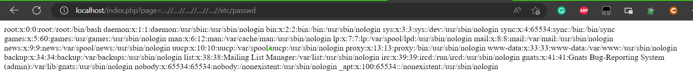

<div align='center'>

# **Broken Access Control**

</div>

## **1. Description**

Access control, sometimes called authorization, is how a web application grants access to content and functions to some users and not others. These checks are performed after authentication, and govern what 'authorized' users are allowed to do. Access control sounds like a simple problem but is insidiously difficult to implement correctly. A web application’s access control model is closely tied to the content and functions that the site provides. In addition, the users may fall into a number of groups or roles with different abilities or privileges.

Broken access control refers to a security vulnerability that occurs when an application does not properly restrict access to sensitive resources, such as user accounts, data, or functionality. This vulnerability can be exploited by attackers to gain unauthorized access to sensitive information, perform actions that should be restricted, or escalate their privileges to gain administrative access

There are some common broken access control vulnerabilities:

-   **Directory traversal**: This vulnerability occurs when an application allows a user to access files and directories that are outside the intended directory.
-   **Insecure direct object references (IDOR)**: This vulnerability occurs when an application uses predictable or sequential identifiers to access objects, such as user accounts, files, or database entries.
-   **Privilege escalation**: A user gets access to more resources or functionality than they are normally allowed, and such elevation or changes should have been prevented by the application
-   **Bypassing authorization schema**: Bypassing the restrictions and limitations set by an application's authorization mechanism, such as a user role or access level.

For example, in this [Web Project](./Vuln%20Web/) this php function `include` when not implement correctly, the attacker can retrieve the content of any file on server.

```php
include("/var/www/html/".str_replace("../","",$file));
```
If the attacker send the payload `....//....//....//....//etc/passwd` the function will return the content of the file `/etc/passwd



## **2. How to test**

### **2.1. Directory traversal**

- [ ] Identify the injection point on the URL
- [ ] Test for local file inclusion (LFI)
- [ ] Test for remote file inclusion (RFI)
- [ ] Test traversal on the URL parameters
- [ ] Test traversal on the cookie parameters

**OS Specific**

- [ ] Unix
    -   Root directory: `/`
    -   Directory separator: `/`
- [ ] Windows
    -   Root directory: `<drive letter>:`
    -   Directory separator: `\` or `/`
- [ ] MacOS
    -   Root directory: `/`
    -   Directory separator: `/`

**Top 25 parameter that could be vulnerable to local file inclusion (LFI) vulnerabilities**

- [ ] ?cat={payload}
- [ ] ?dir={payload}
- [ ] ?action={payload}
- [ ] ?board={payload}
- [ ] ?date={payload}
- [ ] ?detail={payload}
- [ ] ?file={payload}
- [ ] ?download={payload}
- [ ] ?path={payload}
- [ ] ?folder={payload}
- [ ] ?prefix={payload}
- [ ] ?include={payload}
- [ ] ?page={payload}
- [ ] ?inc={payload}
- [ ] ?locate={payload}
- [ ] ?show={payload}
- [ ] ?doc={payload}
- [ ] ?site={payload}
- [ ] ?type={payload}
- [ ] ?view={payload}
- [ ] ?content={payload}
- [ ] ?document={payload}
- [ ] ?layout={payload}
- [ ] ?mod={payload}
- [ ] ?conf={payload}

**Vulnerbility functions**

- [ ] **php:** include(), include_once(), require(), require_once(), fopen(), readfile(), file_get_contents(), ...
- [ ] **JSP/Servlet:** java.io.File(), java.io.FileReader(), ...
- [ ] **asp:** include file, include virtual, ...

### **2.2. Authorization Schema Bypass**

- [ ] Testing for Horizontal Bypassing Authorization Schema

    - [ ] Is it possible to access resources that should be accessible to a user that holds a different identity with the same role or privilege?
    - [ ] Is it possible to operate functions on resources that should be accessible to a user that holds a different identity?

- [ ] Testing for Access to Administrative Functions

    - [ ] Identify the administrative functions
    - [ ] Is it possible to access administrative functions without being authenticated as an administrator?

- [ ] Testing for Access to Resources Assigned to a Different Role

    - [ ] Is it possible to access resources assigned to a different role?
    - [ ] Is it possible to retrive them, modify them, or delete them?

- [ ] Test override the target with custom headers

```
X-Original-URL
X-Rewrite-URL
X-Forwarded-For
X-Forward-For
X-Remote-IP
X-Originating-IP
X-Remote-Addr
X-Client-IP
```

### **2.3. Privilege Escalation**

- [ ] Testing for Role/Privilege Manipulation

    - [ ] Manipulation of User Group
    - [ ] Manipulation of User Profile
    - [ ] Manipulation of Condition Value
    - [ ] Manipulation of IP Address

- [ ] Testing for Vertical Bypassing Authorization Schema

    - [ ] Is it possible to access resources that should be accessible only to a higher role user.
    - [ ] Is it possible to operate functions on resources that should be operative only by a user that holds a higher or specific role identity.

- [ ] Testing for Path Traversal
- [ ] Testing for Weak Session ID

### **2.4. IDOR**

- [ ] Test to change the ID parameter
- [ ] Test to add parameters at the endpoints
- [ ] Test for HTTP parameter pollution
- [ ] Test by adding an extension at the end
- [ ] Test with outdated API versions
- [ ] Test by wrapping the ID with an array
- [ ] Test by wrapping the ID with a JSON object
- [ ] Test for JSON parameter pollution
- [ ] Test by changing the case
- [ ] Test for path traversal
- [ ] Test by changing words
- [ ] Test by changing methods

## **3. How to fix**

-   Identify all access control points in your application, including user roles, permissions, and authorization mechanisms.
-   Conduct a security assessment of your application to identify potential vulnerabilities and security gaps in your access control mechanisms.
-   Implement a strong and secure authentication and authorization mechanism, such as OAuth or OpenID Connect, that can handle different user roles and permissions.
-   Use input validation and sanitization to ensure that user input is valid and does not contain malicious code or scripts.
-   Enforce the principle of least privilege by ensuring that users have only the minimum level of access necessary to perform their tasks.
-   Restricting access to all resources or functionality unless they’re intended to be public.
-   Implement session management mechanisms to control user sessions and prevent unauthorized access.
-   Regularly monitor and audit access logs and user activities to identify any suspicious or unauthorized access attempts.
-   If (Cross-Origin Resource Sharing) CORS is enabled, try to limit CORS usage. Ensure that the Access-Control-Allow-Origin header is set to a specific domain or a wildcard, and not set to *.

For example, the `include` function mentioned in the previous section can be fixed by applying whitelist validation to the input parameter.

```php
allowed = ['about', 'contact', 'home', 'services']
if in_array($file, allowed) {
    include("/var/www/html/".str_replace("../","",$file));
}
```

## **4. How to bypass**

**Directory traversal**

- Absolute path
- Null byte
- URL encoding
- Double URL encoding
- Bypass `../` replace by "" non-recursively (`....//`)
- Bypass `../` with `;` (`..;/`)
- Bypass `../../` check (`.././../`)

## **5. Tools**

- [Burp Suite](https://portswigger.net/)

**Directory traversal**
- [Dotdotpwn](https://github.com/wireghoul/dotdotpwn)
- [PathTraversal Fuzz String](https://github.com/xmendez/wfuzz/blob/master/wordlist/Injections/Traversal.txt)
- [Burp Suite](https://portswigger.net/)
- [DirBuster](https://sourceforge.net/projects/dirbuster/)
- [grep](http://man7.org/linux/man-pages/man1/egrep.1.html)
- Encoding/Decoding Tools

## **6. References**

- https://owasp.org/Top10/A01_2021-Broken_Access_Control/
- https://owasp.org/www-project-web-security-testing-guide/latest/4-Web_Application_Security_Testing/05-Authorization_Testing/README
- https://book.hacktricks.xyz/pentesting-web/file-inclusion
- https://github.com/swisskyrepo/PayloadsAllTheThings/tree/master/File%20Inclusion
- https://github.com/swisskyrepo/PayloadsAllTheThings/tree/master/Directory%20Traversal
- https://nordicapis.com/how-to-fix-broken-access-control/
- https://cheatsheetseries.owasp.org/cheatsheets/Authorization_Testing_Automation_Cheat_Sheet.html