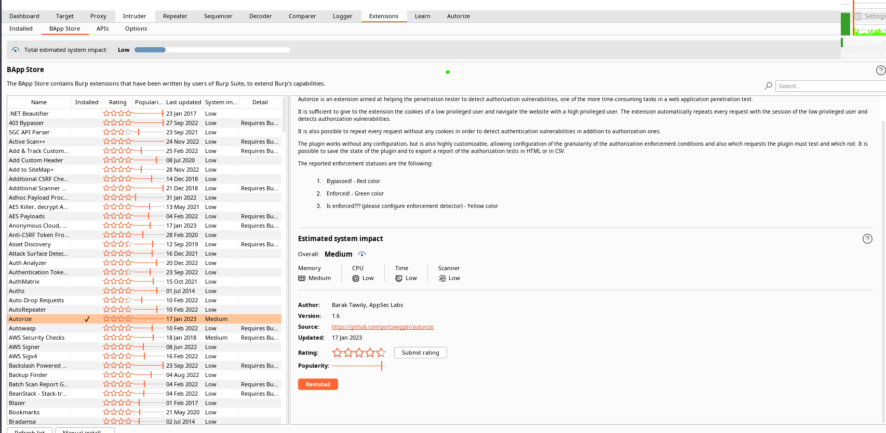
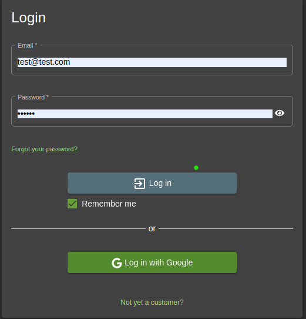
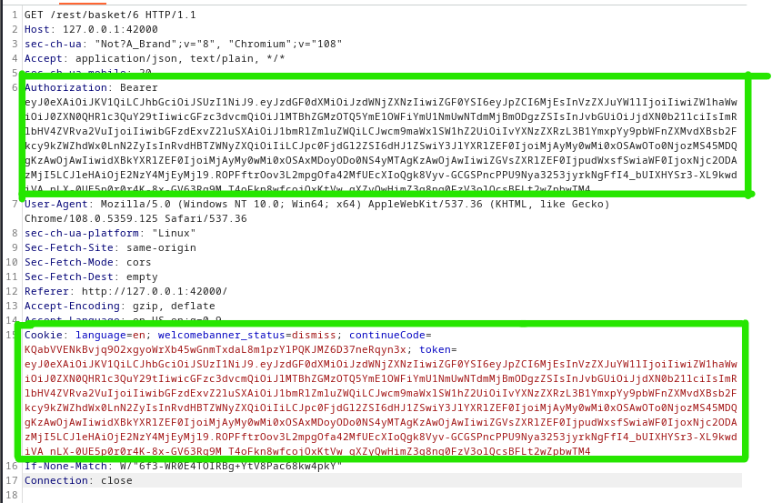
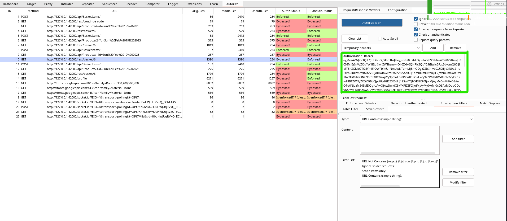
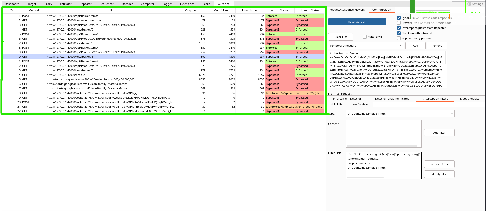

Example Web: [OWASP Juice Shop](https://juice-shop.herokuapp.com/#/)

**Installation**
Install apps directly within Burp via the BApp Store feature in the Burp extender tool.

**Usage**

1. Login to the application

2. In the Burp Suite, go to the Proxy tab search for user's session cookie or Authorization header.

3. Copy the cookie and Authorization header and paste it into the text box like below.

4. Try to navigate to all endpoint of the website. You will see the result similar like below.

To identify potential IDORs, Authorize use different colors to highlight in Authorize Status and Unauth Status columns:  

-   Red “bypassed!”: endpoint could be vulnerable to IDOR,  
-   Orange “Is enforced!”: endpoint seems to be protected but look anyway,  
-   Green “Enforced!”: endpoint is clearly protected against IDOR. 
-   Be careful; authorized displaying may occur red highlight requests does not mean that all endpoints are systematically vulnerable. There may be false positives; it’s up to you to double-check the output.

Now compare the response size between each query: if it’s the same, go deeper!  

-   Original Length: is the size of the response from our original session (our victim account)  
-   Modified Length: is the response from the same request replayed by Authorize using the attacker cookies (automatically replayed by Authorize)  
-   Unauthenticated Length: is also the same request as our victim account but without cookies session (to test if the endpoint is vulnerable to Improper Access Control) 