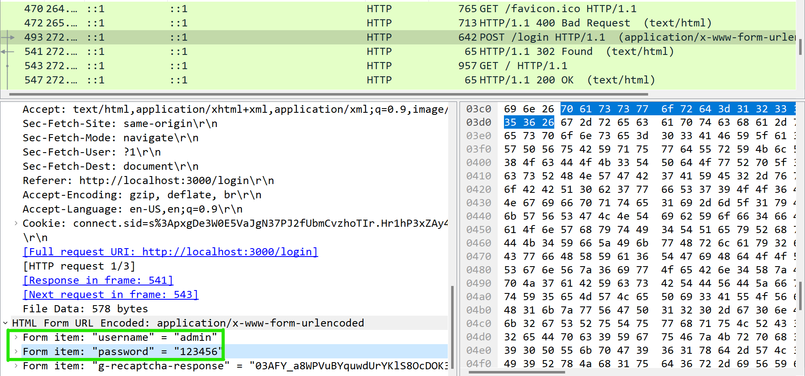

<div align='center'>

# **[My Simple Website](./Vuln%20Web/) Pentest Report**

</div>

## **1. The use of HTTP Protocol which will leak the request as plaintext [High]**

### **Description and Impact**

The website is using HTTP protocol which is not secure. An attacker can intercept the traffic and look at the http request and http respond clearly. This will lead to the leakage of sensitive information such as user's credentials.

### **Root-cause analysis**

In the file [app.js](./Vuln%20Web/app.js) at line 98 to 101, the website is using HTTP protocol to communicate with the server.

```javascript
var server = http.createServer(app);
server.listen(port, () => {
	console.log(`Server is running at port ${port}`);
});
```

The app is also using HTTPS protocol, however, the HTTP protocol is still open and can be accessed by the attacker.

### **Steps to Reprocedure**

1. Turn on [Wireshark](https://www.wireshark.org/) and use loopback interface to capture the traffic.

2. Navigate to the website `localhost:3000/login` and login with the following credentials:

        username: admin
        password: 123456

3. The attacker can see the http request and http respond clearly on Wireshark.



### **Recommendation**

Turn off the HTTP protocol or redirect the HTTP request to HTTPS protocol.

```javascript
app.all('*', (req, res, next) => {
	if (req.secure) {
		return next();
	}
	res.redirect('https://' + req.hostname + ':' + securePort + req.url);
});
```

### **References**

1. https://www.cloudflare.com/learning/ssl/why-is-http-not-secure/

## **2. Logic flaw at login function which lead to bypass login check [High]**

### **Description and Impact**

At endpoint `/admin`, there is a logic flaw at login check. This allows an attacker to use unauthenticated function without logging in.

### **Root-cause analysis**

In the file [app.js](./Vuln%20Web/app.js) at line 56 to 61, there is a function named `checkLogin`.

```javascript
function checkLogin(req, res, next) {
    if (!req.session.user) {
        res.redirect('/login');
    }
    next();
}
```

Due to missing `return` statement, the `next()` function will be executed even if the login check fails. Therefore, the attacker can use the unauthenticated function normally without logging in. In this case, the attacker can add a new user to the database.

### **Steps to Reprocedure**

Using this [script](payload.py) to add a new user to the database.

### **Recommendation**

Add `return` statement to the `checkLogin` function.

```javascript
function checkLogin(req, res, next) {
    if (!req.session.user) {
        res.redirect('/login');
        return;
    }
    next();
}
```